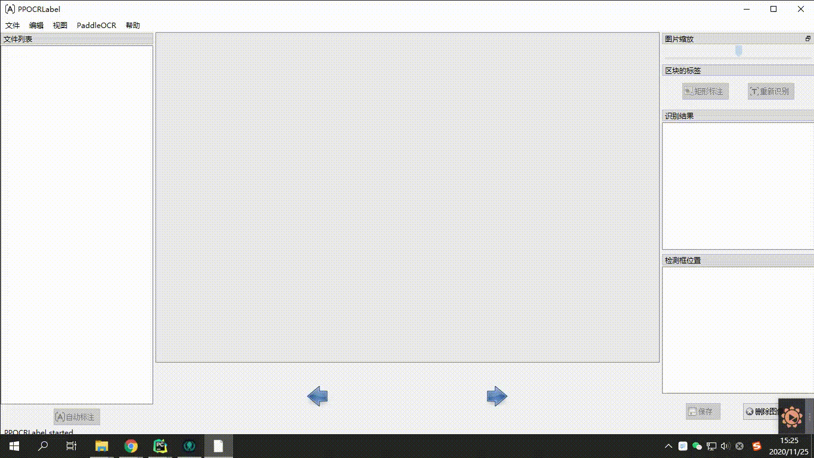

# PPOCRLabel

PPOCRLabel là mô hình nhận dạng kí tự bán tự động. Sử dụng python và PyQT5, hỗ trợ chú thích bằng hình hộp chữ nhật...



## Installation

### 1. Cài đặt PaddleOCR
```bash
pip3 install --upgrade pip

# Hiện tại paddle support CUDA đến 12.0 , tuy nhiên cần cài đặt đầy đủ CUDA, cuDNN và TensorRT theo phiên bản tại trang chủ
python3 -m pip install paddlepaddle-gpu -i https://mirror.baidu.com/pypi/simple

# Khuyến nghị sử dụng phiên bản CPU của paddle paddle
python3 -m pip install paddlepaddle -i https://mirror.baidu.com/pypi/simple
```

Tham khảo thêm tại : [PaddleOCR installation document](https://github.com/PaddlePaddle/PaddleOCR/blob/develop/doc/doc_ch/installation.md)

### 2. Cài đặt PPOCRLabel

#### Windows + Anaconda

Tải và cài đặt [Anaconda](https://www.anaconda.com/download/#download) (Python 3+)

```bash
pip install PPOCRLabel  # cài đặt tool

# Select label mode and run 
PPOCRLabel  # Chế độ trích xuất cơ bản
PPOCRLabel --kie True # Chế độ thêm trích xuất từ đã được tự động gán nhãn
```
Cân nhắc nếu xảy ra một số lỗi khi xung đột phiên bản pyqt trên Windows
```
conda install pyqt / pip3 install pyqt
cd ./PPOCRLabel # Change the directory to the PPOCRLabel folder
pyrcc5 -o libs/resources.py resources.qrc
python PPOCRLabel.py --lang vi
```
#### Để đơn giản hơn , sau khi cài PaddlePaddle, hãy clone repository này của tôi về và chạy :

[PPOCRLabel-fixed](https://github.com/DuyTa506/OCR_Annotation.git)

```
cd ./PPOCRLabel # Change the directory to the PPOCRLabel folder
python PPOCRLabel.py --lang vi
```

#### Ubuntu Linux

```
pip3 install pyqt5
pip3 install trash-cli
cd ./PPOCRLabel # Change the directory to the PPOCRLabel folder
python3 PPOCRLabel.py --lang vi
```

#### macOS
```
pip3 install pyqt5
pip3 uninstall opencv-python # Uninstall opencv manually as it conflicts with pyqt
pip3 install opencv-contrib-python-headless # Install the headless version of opencv
cd ./PPOCRLabel # Change the directory to the PPOCRLabel folder
python3 PPOCRLabel.py --lang vi
```

## hướng dẫn sử dụng 

### Các bước 

1. Tải và cài đặt hướng dẫn phía trên. 

2. Click 'Open Dir' ở Menu/File để chọn folder của ảnh.<sup>[1]</sup>

3. Click 'Auto recognition' ở góc bên trái màn hình, sử dụng PPOCR model để tự động chú thích các hình ảnh được đánh dấu 'X' <sup>[2]</sup>trước file name.

4. Tạo bbox:

   4.1 Click 'Create RectBox' hoặc nhấn 'W' để vẽ box nhận diện. Nhấn và thả chuột trái để chọn vùng cần chú thích cho vùng văn bản.

   4.2 Nhấn 'Q' để vào chế độ ghi nhãn bốn điểm cho phép bạn tạo bất kỳ hình dạng bốn điểm nào bằng cách nhấp vào bốn điểm bằng nút chuột trái liên tiếp và NHẤP NHÂN ĐÔI chuột trái làm tín hiệu hoàn thành ghi nhãn

5. Sau khi khung đánh dấu được vẽ, người dùng nhấp vào "OK" và khung phát hiện sẽ được gán trước nhãn "TEMPORARY" .

6. Click 're-Recognition', model sẽ ghi lại tất cả  ALL detection box<sup>[3]</sup>.

7. Double click vào 'recognition result' danh sách để thay đổi kết quả nhận dạng không chính xác theo cách thủ công.

8. Click "Save", trạng thái của ảnh sẽ chuyển sang "√",chương trình sẽ tự nhảy sang ảnh tiếp theo.

9. Click "Delete Image" hình ảnh sẽ bị xóa vào thùng rác.

10. Kết quả ghi nhãn: Sau khi đóng ứng dụng hoặc chuyển đổi đường dẫn tệp, nhãn được lưu thủ công sẽ được lưu trữ trong *Label.txt* trong thư mục ảnh đã mở.
     Nhấp vào "PaddleOCR"-"Lưu kết quả nhận dạng" trên thanh menu, dữ liệu huấn luyện nhận dạng của những ảnh đó sẽ được lưu trong thư mục *crop_img* và nhãn nhận dạng sẽ được lưu trong *rec_gt.txt*<sup>[4] </sup>.


## Explanation

### Built-in Model

- Default model: PPOCRLabel sử dụng Chinese and English ultra-lightweight OCR model in PaddleOCR mặc định, hỗ trợ Chinese, English và nhận diện số, và cũng như phát hiện nhiều ngôn ngữ .
- Paddle OCR hiện tại chưa hỗ trợ mô hình cho tiếng việt.
- Có thể chuyển đổi nhận diện giữa các ngôn ngữ. 
  tham khảo [PaddleOCR Model List](https://github.com/PaddlePaddle/PaddleOCR/blob/develop/doc/doc_en/models_list_en.md#multilingual-recognition-modelupdating)


### Related

1.[Tzutalin. LabelImg. Git code (2015)](https://github.com/tzutalin/labelImg)
